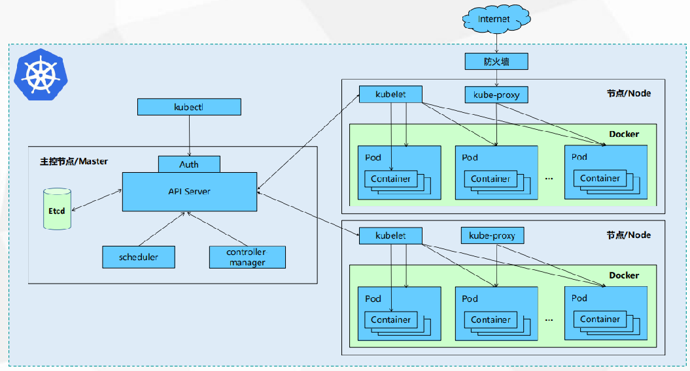
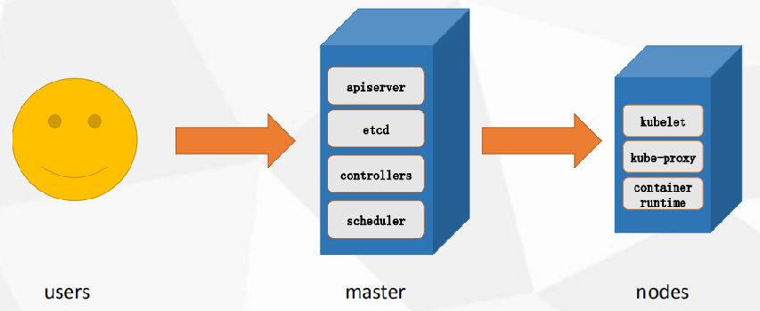
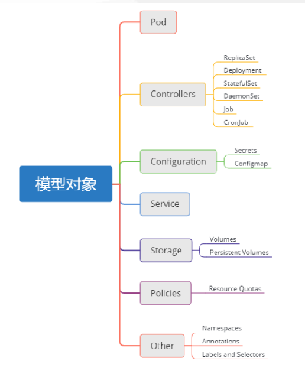

<h1>Kubernetes</h1>

## 1. 介绍

- Kubernetes是Google在2014年开源的一个容器集群管理系统，Kubernetes简称K8S。
- K8S用于容器化应用程序的部署，扩展和管理。
- K8S提供了容器编排，资源调度，弹性伸缩，部署管理，服务发现等一系列功能。
- Kubernetes目标是让部署容器化应用简单高效。

&#160; &#160; &#160; &#160;Kubernetes 是用于自动部署，扩展和管理容器化应用程序的开源系统。
它将组成应用程序的容器组合成逻辑单元，以便于管理和服务发现，Kubernetes 构建在 Google 15 年生产环境经验基础之上,并结合来自社区的最佳创意和实践。
> 以上来自官网解释

[官方网站](http://www.kubernetes.io)

## 2. 特性
### 2.1 自我修复

&#160; &#160; &#160; &#160;在节点故障时重新启动失败的容器，替换和重新部署，保证预期的==副本数量==；杀死健康检查失败的容器，并且在未准备好之前不会处理客户端请求，确保线上服务不中断。

### 2.2 弹性伸缩

&#160; &#160; &#160; &#160;使用命令、UI或者基于CPU使用情况自动快速扩容和缩容应用程序实例，保证应用业务高峰并发时的高可用性；业务低峰时回收资源，==以最小成本运行服务==。

### 2.3 自动部署和回滚

&#160; &#160; &#160; &#160;K8S采用滚动更新策略更新应用，一次更新一个Pod，而不是同时删除所有Pod，如果更新过程中出现问题，将回滚更改，确保升级不受影响业务。

### 2.4 服务发现和负载均衡

&#160; &#160; &#160; &#160;K8S为多个容器提供一个==统一访问入口==（内部IP地址和一个DNS名称），并且负载均衡关联的所有容器，使得==用户无需考虑容器IP问题==。

### 2.5 机密和配置管理

&#160; &#160; &#160; &#160;管理机密数据和应用程序配置，而不需要把敏感数据暴露在镜像里，提高敏感数据安全性。并可以将一些常用的配置存储在K8S中，方便应用程序使用。

### 2.6 存储编排

&#160; &#160; &#160; &#160;挂载外部存储系统，无论是来自本地存储，公有云（如AWS），还是网络存储（如NFS、GlusterFS、Ceph）都作为==集群资源的一部分使用==，极大提高存储使用灵活性。

### 2.7 批处理

&#160; &#160; &#160; &#160;提供一次性任务，定时任务；满足批量数据处理和分析的场景。

## 3. 集群架构与组件

### 3.1 Master组件
#### 3.1.1 ube-apiserver

&#160; &#160; &#160; &#160;Kubernetes API，集群的统一入口，各组件协调者，以RESTful API提供接口
服务，所有对象资源的增删改查和监听操作都交给APIServer处理后再提交给
Etcd存储。

#### 3.1.2 kube-controller-manager

&#160; &#160; &#160; &#160;处理集群中常规后台任务，一个资源对应一个控制器，而ControllerManager
就是负责管理这些控制器的。

#### 3.1.3 kube-scheduler

&#160; &#160; &#160; &#160;根据调度算法为新创建的Pod选择一个Node节点，可以任意部署,可以部署在
同一个节点上,也可以部署在不同的节点上。

#### 3.1.4 etcd

&#160; &#160; &#160; &#160;分布式键值存储系统。用于保存集群状态数据，比如Pod、Service等对象信息

### 3.2 Noder组件
#### 3.2.1 kubelet

&#160; &#160; &#160; &#160;kubelet是Master在Node节点上的Agent，管理本机运行容器的生命周期，比如创建容器、Pod挂载数据卷、下载secret、获取容器和节点状态等工作。kubelet将每个Pod转换成一组容器。

#### 3.2.2 kube-proxy

&#160; &#160; &#160; &#160;在Node节点上实现Pod网络代理，维护网络规则和四层负载均衡工作。

#### 3.2.3 docker或rocket

&#160; &#160; &#160; &#160;容器引擎，运行容器。

## 4. 核心概念

### 4.1 Pod

- 最小部署单元
- 一组容器的集合
- 一个Pod中的容器共享网络命名空间
- Pod是短暂的

### 4.2 Controllers

- ReplicaSet ： 确保预期的Pod副本数量
- Deployment ： 无状态应用部署
- StatefulSet ： 有状态应用部署
- DaemonSet ： 确保所有Node运行同一个Pod
- Job ： 一次性任务
- Cronjob ： 定时任务

更高级层次对象，部署和管理Pod

### 4.3 Service

- 防止Pod失联
- 定义一组Pod的访问策略

### 4.4 Label 
标签，附加到某个资源上，用于关联对象、查询和筛选

### 4.5 Namespaces 
命名空间，将对象逻辑上隔离

### 4.6 Annotations 
注释
