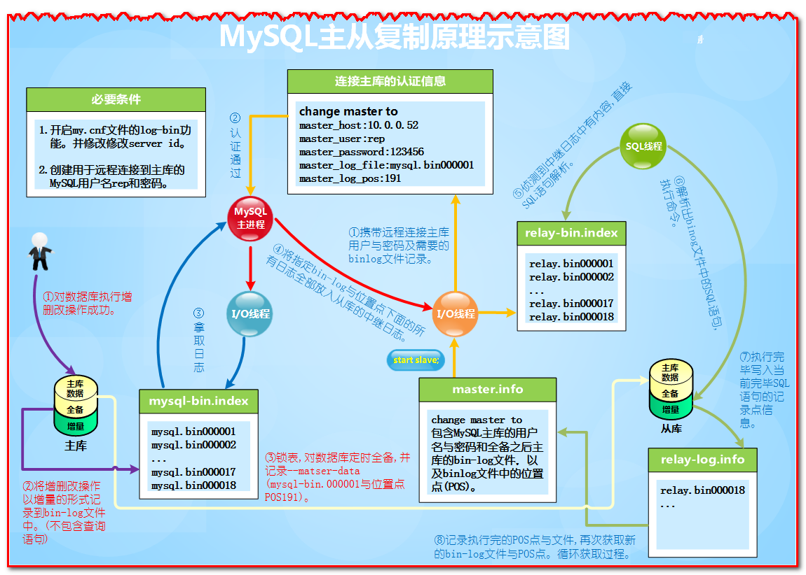

<center><h1> MySQL 主从 </h1></center>

## 1. 原理
&#160; &#160; &#160; &#160;MySQL的主从复制方案，和文件系统级别同步是类似的，都是数据的传输。只不过MySQL无需借助第三方软件工具，而是其自带的同步复制功能。另外MySQL的主从复制并不是在磁盘上文件直接同步，而是用逻辑的binlog日志同步到本地，再应用执行的过程。

&#160; &#160; &#160; &#160;我们通常希望在每次插入新记录时自动创建主键字段的值。我们可以在表中创建一个自动增量（auto-increment）字段。

## 2. MySQL主从复制介绍
&#160; &#160; &#160; &#160;MySQL数据库支持单向、双向、链式级联等不同场景的复制。在复制过程中，一台服务器充当主服务器(Master)，而一个或多个其他的服务器充当从服务器(Slave)。

&#160; &#160; &#160; &#160;复制可以是单向的M→S，也可以是M←→M，当然也可以多M环状同步等。

&#160; &#160; &#160; &#160;如果设置了链式级联复制，那么从(Slave)服务器本身除了充当从服务器外，也会同时充当其下面从服务器的主服务器。链式级联复制类似A→B→C→D的复制形式。

&#160; &#160; &#160; &#160;在当前的生产工作中，MySQL主从复制都是异步的复制方式，即不是严格实时的数据同步。

## 3. MySQL主从复制的原理
&#160; &#160; &#160; &#160;MySQL的主从复制是一个异步的复制过程，数据将从一个MySQL数据库复制到另一个数据库，在主数据库与从数据库之间实现整个主从复制的过程是由三个线程参与完成的。其中有两个线程(SQL线程、IO线程)在从数据库端，另外一个IO线程在主数据库端。

&#160; &#160; &#160; &#160;要实现MySQL的主从复制，首先必须打开Master端的binlog记录功能，否则就无法实现。因为整个复制过程实际上就是Slave从Master端获取binlog日志，然后再在Slave端上依相同顺序执行获取的binlog日志中所记录的各种SQL操作。详细流程请参阅如下图片文档。



## 4. 环境准备
### 4.1 环境

IP地址 | 角色 | mysql版本号|系统|主机名
---|---|---|---|---
192.168.5.110| mysql master|5.7|ubuntu16|leco
192.168.2.148| mysql slave|5.7|ubuntu16|manage01

### 4.2 配置准备
#### 4.2.1 master准备

- 开启二进制日志
- 配置唯一的server-id
- 获得master二进制日志文件名及位置
- 创建一个用于slave和master通信的用户账号

#### 4.2.2 slave准备

- 配置唯一的server-id
- 使用master分配的用户账号读取master二进制日志
- 启用slave服务

## 5. master 操作
### 5.1 修改master配置文件
&#160; &#160; &#160; &#160;找到主数据库的配置文件my.cnf(或者my.ini)，我的在/etc/mysql/my.cnf,在[mysqld]部分插入如下两行：

```
root@leco:/etc/mysql/mysql.conf.d# ls mysqld.cnf
mysqld.cnf
root@leco:/etc/mysql/mysql.conf.d# egrep -irn 'log_bin|server-id' mysqld.cnf
83:server-id		= 1
84:log_bin			= /var/log/mysql/mysql-bin.log
```
&#160; &#160; &#160; &#160;配置完毕后，重启mysql
```
root@leco:/etc/mysql/mysql.conf.d# /etc/init.d/mysql restart
[ ok ] Restarting mysql (via systemctl): mysql.service.
```

### 5.2 授权同步账号
&#160; &#160; &#160; &#160;创建用户并授权：用户：repl，密码：repl
```
grant all privileges on *.* to repl@'%' identified by 'repl';
```
操作过程

```
mysql> select host,user from mysql.user;
+-----------+------------------+
| host      | user             |
+-----------+------------------+
| %         | root             |
| localhost | debian-sys-maint |
| localhost | mysql.session    |
| localhost | mysql.sys        |
| localhost | root             |
+-----------+------------------+
5 rows in set (0.00 sec)

mysql> grant replication slave on *.* to 'repl'@'%' identified by 'repl';
Query OK, 0 rows affected, 1 warning (0.01 sec)

mysql> flush privileges;
Query OK, 0 rows affected (0.01 sec)

mysql> select host,user from mysql.user;
+-----------+------------------+
| host      | user             |
+-----------+------------------+
| %         | repl             |
| %         | root             |
| localhost | debian-sys-maint |
| localhost | mysql.session    |
| localhost | mysql.sys        |
| localhost | root             |
+-----------+------------------+
6 rows in set (0.00 sec)
```
### 5.3 记录状态
```
# 查看master状态，记录二进制文件名(mysql-bin.000003)和位置(73)：
mysql> show master status;
+------------------+----------+--------------+------------------+-------------------+
| File             | Position | Binlog_Do_DB | Binlog_Ignore_DB | Executed_Gtid_Set |
+------------------+----------+--------------+------------------+-------------------+
| mysql-bin.000001 |     1571 |              |                  |                   |
+------------------+----------+--------------+------------------+-------------------+
1 row in set (0.00 sec)

```

!!! note "注意"
    ```python
    注意这个文件mysql-bin.000001和点1571
    ```

## 6. slave 操作
### 6.1 修改master配置文件
&#160; &#160; &#160; &#160;找到主数据库的配置文件my.cnf(或者my.ini)，修改server-id。

```
root@manage01:/etc/mysql/mysql.conf.d# grep 'server-id' mysqld.cnf
server-id		= 2
```

??? info "注意"
    ```python
    1. 主从的server-id一定要不一样，一般配置成ip地址最后一位。
    2. 本文我为了省事，直接修改为master为1，slave2。
    ```
&#160; &#160; &#160; &#160; 重启从的mysql。

```
root@manage01:~# /etc/init.d/mysql restart
[ ok ] Restarting mysql (via systemctl): mysql.service.
```

### 6.2 链接
### 6.2.1 快速命令

```
stop slave;
grant all privileges on *.* to repl@'%' identified by 'repl';
change master to master_host='192.168.5.110',\
                 master_port=3306,\
                 master_user='repl',\
                 master_password='repl',\
                 master_log_file='mysql-bin.000001',\
                 master_log_pos=1571;
start slave;
show slave status\G;
```
&#160; &#160; &#160; &#160; 操作过程
```
mysql> stop slave;
Query OK, 0 rows affected, 1 warning (0,00 sec)

mysql> change master to master_host='192.168.5.110',\
    ->                  master_port=3306,\
    ->                  master_user='repl',\
    ->                  master_password='repl',\
    ->                  master_log_file='mysql-bin.000001',\
    ->                  master_log_pos=1571;
Query OK, 0 rows affected, 2 warnings (0.09 sec)

mysql> start slave;
Query OK, 0 rows affected (0.00 sec)
```

### 6.2.2 查看状态

&#160; &#160; &#160; &#160; 在从上查看mysql状态
```
mysql> show slave status\G;
*************************** 1. row ***************************
               Slave_IO_State: Waiting for master to send event
                  Master_Host: 192.168.5.110
                  Master_User: repl
                  Master_Port: 3306
                Connect_Retry: 60
              Master_Log_File: mysql-bin.000001
          Read_Master_Log_Pos: 1571
               Relay_Log_File: manage01-relay-bin.000002
                Relay_Log_Pos: 320
        Relay_Master_Log_File: mysql-bin.000001
             Slave_IO_Running: Yes
            Slave_SQL_Running: Yes
              Replicate_Do_DB:
          Replicate_Ignore_DB:
           Replicate_Do_Table:
       Replicate_Ignore_Table:
      Replicate_Wild_Do_Table:
  Replicate_Wild_Ignore_Table:
                   Last_Errno: 0
                   Last_Error:
                 Skip_Counter: 0
          Exec_Master_Log_Pos: 1571
              Relay_Log_Space: 530
              Until_Condition: None
               Until_Log_File:
                Until_Log_Pos: 0
           Master_SSL_Allowed: No
           Master_SSL_CA_File:
           Master_SSL_CA_Path:
              Master_SSL_Cert:
            Master_SSL_Cipher:
               Master_SSL_Key:
        Seconds_Behind_Master: 0
Master_SSL_Verify_Server_Cert: No
                Last_IO_Errno: 0
                Last_IO_Error:
               Last_SQL_Errno: 0
               Last_SQL_Error:
  Replicate_Ignore_Server_Ids:
             Master_Server_Id: 1
                  Master_UUID: 806dc48e-07eb-11e9-89c3-7427eab0aa2c
             Master_Info_File: /var/lib/mysql/master.info
                    SQL_Delay: 0
          SQL_Remaining_Delay: NULL
      Slave_SQL_Running_State: Slave has read all relay log; waiting for more updates
           Master_Retry_Count: 86400
                  Master_Bind:
      Last_IO_Error_Timestamp:
     Last_SQL_Error_Timestamp:
               Master_SSL_Crl:
           Master_SSL_Crlpath:
           Retrieved_Gtid_Set:
            Executed_Gtid_Set:
                Auto_Position: 0
         Replicate_Rewrite_DB:
                 Channel_Name:
           Master_TLS_Version:
1 row in set (0,00 sec)

ERROR:
No query specified
```

> 以上看到两个yes一般都是主从OK。

&#160; &#160; &#160; &#160; 当Slave_IO_Running和Slave_SQL_Running都为YES的时候就表示主从同步设置成功了。接下来就可以进行一些验证了，比如在主master数据库的test数据库的一张表中插入一条数据，在slave的test库的相同数据表中查看是否有新增的数据即可验证主从复制功能是否有效，还可以关闭slave（mysql>stop slave;）,然后再修改master，看slave是否也相应修改（停止slave后，master的修改不会同步到slave），就可以完成主从复制功能的验证了。

&#160; &#160; &#160; &#160; 还可以用到的其他相关参数：master开启二进制日志后默认记录所有库所有表的操作，可以通过配置来指定只记录指定的数据库甚至指定的表的操作，具体在mysql配置文件的[mysqld]可添加修改如下选项：

```
# 不同步哪些数据库  
binlog-ignore-db = mysql  
binlog-ignore-db = test  
binlog-ignore-db = information_schema  
  
# 只同步哪些数据库，除此之外，其他不同步  
binlog-do-db = game
```


## 7. 测试
### 7.1 主加数据
&#160; &#160; &#160; &#160; 在主mysql上添加一些数据

```
create database summer;
use summer;
drop table info;
create table info(
id int not null primary key auto_increment,
name varchar(20),
age int not null,
score int not null
);
insert into info(name,age,score) values('aa',30,66);
insert into info(name,age,score) values('bb',30,66);
insert into info(name,age,score) values('cc',30,66);
```
操作过程
```
mysql> create database summer;
Query OK, 1 row affected (0.01 sec)

mysql> use summer;
Database changed
mysql> drop table info;
ERROR 1051 (42S02): Unknown table 'summer.info'
mysql> create table info(
    -> id int not null primary key auto_increment,
    -> name varchar(20),
    -> age int not null,
    -> score int not null
    -> );
Query OK, 0 rows affected (0.07 sec)

mysql> insert into info(name,age,score) values('aa',30,66);
Query OK, 1 row affected (0.01 sec)

mysql> insert into info(name,age,score) values('bb',30,66);
Query OK, 1 row affected (0.02 sec)

mysql> insert into info(name,age,score) values('cc',30,66);
Query OK, 1 row affected (0.01 sec)

```


### 7.2 从检查
&#160; &#160; &#160; &#160; 登录从查看

```
mysql> use summer;
Reading table information for completion of table and column names
You can turn off this feature to get a quicker startup with -A

Database changed
mysql> show tables;
+------------------+
| Tables_in_summer |
+------------------+
| info             |
+------------------+
1 row in set (0,00 sec)

mysql> select * from info;
+----+------+-----+-------+
| id | name | age | score |
+----+------+-----+-------+
|  1 | aa   |  30 |    66 |
|  2 | bb   |  30 |    66 |
|  3 | cc   |  30 |    66 |
+----+------+-----+-------+
3 rows in set (0,00 sec)
```
从结果来看，从已经同步了主的数据，do well done！

## 8. 遗漏
&#160; &#160; &#160; &#160; 在做主从同步的时候，我省略了一点，要先把主上的数据库同步到从上。
