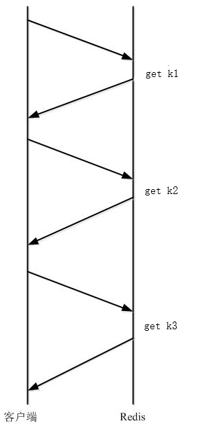
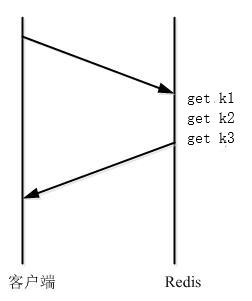

<center><h1> redis pipeline </h1></center>
## 1. Python Redis pipeline介绍
&#160; &#160; &#160; &#160; Redis是建立在TCP协议基础上的CS架构，客户端client对redis server采取请求响应的方式交互。

&#160; &#160; &#160; &#160; 一般来说客户端从提交请求到得到服务器相应，需要传送两个tcp报文。

&#160; &#160; &#160; &#160; Redis的pipeline(管道)功能在命令行中没有，但redis是支持pipeline的，而且在各个语言版的client中都有相应的实现。 由于网络开销延迟，就算redis server端有很强的处理能力，也会由于收到的client消息少，而造成吞吐量小。当client 使用pipelining 发送命令时，redis server必须将部分请求放到队列中（使用内存），执行完毕后一次性发送结果；如果发送的命令很多的话，建议对返回的结果加标签，当然这也会增加使用的内存；

 &#160; &#160; &#160; &#160;Pipeline在某些场景下非常有用，比如有多个command需要被“及时的”提交，而且他们对相应结果没有互相依赖，对结果响应也无需立即获得，那么pipeline就可以充当这种“批处理”的工具；而且在一定程度上，可以较大的提升性能，性能提升的原因主要是TCP连接中减少了“交互往返”的时间。

&#160; &#160; &#160; &#160;不过在编码时请注意，pipeline期间将“独占”链接，此期间将不能进行非“管道”类型的其他操作，直到pipeline关闭；如果你的pipeline的指令集很庞大，为了不干扰链接中的其他操作，你可以为pipeline操作新建Client链接，让pipeline和其他正常操作分离在2个client中。不过pipeline事实上所能容忍的操作个数，和socket-output缓冲区大小/返回结果的数据尺寸都有很大的关系；同时也意味着每个redis-server同时所能支撑的pipeline链接的个数，也是有限的，这将受限于server的物理内存或网络接口的缓冲能力。

&#160; &#160; &#160; &#160;Redis使用的是客户端-服务器（CS）模型和请求/响应协议的TCP服务器。这意味着通常情况下一个请求会遵循以下步骤：

- 客户端向服务端发送一个查询请求，并监听Socket返回，通常是以阻塞模式，等待服务端响应。
- 服务端处理命令，并将结果返回给客户端。

&#160; &#160; &#160; &#160; Redis客户端与Redis服务器之间使用TCP协议进行连接，一个客户端可以通过一个socket连接发起多个请求命令。每个请求命令发出后client通常会阻塞并等待redis服务器处理，redis处理完请求命令后会将结果通过响应报文返回给client，因此当执行多条命令的时候都需要等待上一条命令执行完毕才能执行。比如：

```
127.0.0.1:6379> get k1
"v1"
127.0.0.1:6379> get k2
"v2"
127.0.0.1:6379> get k3
"v3"
```


&#160; &#160; &#160; &#160;由于通信会有网络延迟，假如client和server之间的包传输时间需要0.125秒。那么上面的三个命令6个报文至少需要0.75秒才能完成。这样即使redis每秒能处理100个命令，而我们的client也只能一秒钟发出四个命令。这显然没有充分利用 redis的处理能力。

&#160; &#160; &#160; &#160;而管道（pipeline）可以一次性发送多条命令并在执行完后一次性将结果返回，pipeline通过减少客户端与redis的通信次数来实现降低往返延时时间，而且Pipeline 实现的原理是队列，而队列的原理是时先进先出，这样就保证数据的顺序性。 Pipeline 的默认的同步的个数为53个，也就是说arges中累加到53条数据时会把数据提交。其过程如下图所示：client可以将三个命令放到一个tcp报文一起发送，server则可以将三条命令的处理结果放到一个tcp报文返回。



!!! note "注意"
    用 pipeline方式打包命令发送，redis必须在处理完所有命令前先缓存起所有命令的处理结果。打包的命令越多，缓存消耗内存也越多。所以并不是打包的命令越多越好。具体多少合适需要根据具体情况测试。

## 2. Python Redis pipeline操作
```
#!/usr/bin/python
# _*_ coding: utf-8 _*_
"""
@Time    : 2019/2/21 13:25
@File    : pipeline_demo.py
@Author  : summer
@Software: PyCharm
"""

import redis
import time

r = redis.Redis(host='127.0.0.1', port=6379, password='')


def try_pipeline():
    start = time.time()
    with r.pipeline(transaction=False) as p:
        p.sadd('set1', 1).sadd('set2', 2).srem('set2', 2).lpush('list1', 1).lrange('list2', 0, -1)
        p.execute()
    print(time.time() - start)


def without_pipeline():
    start = time.time()
    r.sadd('seta', 1)
    r.sadd('seta', 2)
    r.srem('seta', 2)
    r.lpush('lista', 1
    r.lrange('lista', 0, -1)
    print(time.time() - start)


if __name__ == '__main__':
    try_pipeline()
    without_pipeline()
```
运行结果

```
D:\code\code-flask\code-flask\venv\Scripts\python.exe D:/code/code-flask/code-flask/2019-02-20/1.py
0.004987478256225586
0.03494906425476074
```
try_pipeline平均处理时间：0.004987478256225586

without_pipeline平均处理时间：0.03494906425476074

我们的批量里有5个操作，在处理时间维度上性能提升了7倍！

pipeline批量操作只进行一次网络往返，可以看到节省的时间基本都是网路延迟。

2、pipeline与transation

pipeline不仅仅用来批量的提交命令，还用来实现事务transation。
使用transaction与否不同之处在与创建pipeline实例的时候，transaction是否打开，默认是打开的。

```
#!/usr/bin/python
# _*_ coding: utf-8 _*_
"""
@Time    : 2019/2/21 13:25
@File    : pipeline_demo.py
@Author  : summer
@Software: PyCharm
"""
# -*- coding:utf-8 -*-

import redis
from redis import WatchError
from concurrent.futures import ProcessPoolExecutor

r = redis.Redis(host='127.0.0.1', port=6379)


# 减库存函数, 循环直到减库存完成
# 库存充足, 减库存成功, 返回True
# 库存不足, 减库存失败, 返回False
def decr_stock():

    # python中redis事务是通过pipeline的封装实现的
    with r.pipeline() as pipe:
        while True:
            try:
                # watch库存键, multi后如果该key被其他客户端改变, 事务操作会抛出WatchError异常
                pipe.watch('stock:count')
                count = int(pipe.get('stock:count'))
                if count > 0:  # 有库存
                    # 事务开始
                    pipe.multi()
                    pipe.decr('stock:count')
                    # 把命令推送过去
                    # execute返回命令执行结果列表, 这里只有一个decr返回当前值
                    print(pipe.execute()[0])
                    return True
                else:
                    return False
            except WatchError as ex:
                # 打印WatchError异常, 观察被watch锁住的情况
                print(ex, '锁住了')
                pipe.unwatch()


def worker():
    while True:
        # 没有库存就退出
        if not decr_stock():
            break


# 实验开始 设置库存为20
r.set("stock:count", 20)


# 多进程模拟多个客户端提交
if __name__ == '__main__':

    with ProcessPoolExecutor(max_workers=2) as pool:
        for _ in range(10):
            pool.submit(worker)
```
运行结果

```
D:\code\code-flask\code-flask\venv\Scripts\python.exe D:/code/code-flask/code-flask/2019-02-20/1.py
19
18
17
16
19
18
Watched variable changed. 锁住了
17
Watched variable changed. 锁住了
16
Watched variable changed. 锁住了
15
Watched variable changed. 锁住了
Watched variable changed. 锁住了
14
13
Watched variable changed. 锁住了
12
Watched variable changed. 锁住了
11
Watched variable changed. 锁住了
10
9
Watched variable changed. 锁住了
8
7
6
5
Watched variable changed. 锁住了
4
3
2
1
Watched variable changed. 锁住了
0

Process finished with exit code 0

```

